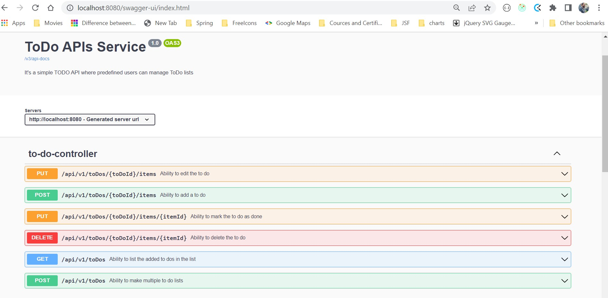
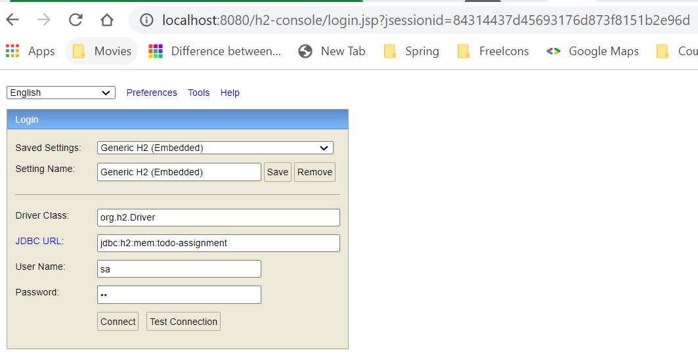
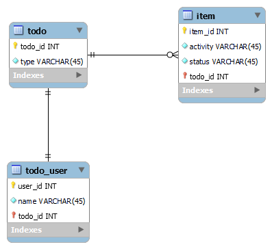

### Az-TODO-assignment

#### Requirements:
It's an API service for a ToDo application with the following features:
* Ability to make multiple to do lists
* Ability to make multiple to do lists
* Ability to add a to do
* Ability to list the added to dos in the list
* Ability to edit the to do
* Ability to delete the to do
* Ability to mark the to do as done
##### Additionally
* The user who created the to do list should be the only one allowed to edit the lists
* Other users should be only allowed to view the lists and the items

#### Technologies:
- Java8
- Spring Boot
- Spring Data JPA
- H2 DB
- Spring Doc open API
- Gradle project

#### How to run
##### Run as a Docker
###### Build Docker image
* Run below command:
```
./gradlew bootBuildImage --imageName=az-todo-assignment
```
###### Run Docker image
```
docker run -p 8080:8080 az-todo-assignment
```
###### Run without Docker
```
./gradlew clean build bootRun
```

#### How to use:
* All the end points are accessible only for authorized users (predefined users).
* Limiting the scope of requirements I have inserted some users in DB by `data.sql`.
* In resources folder I have added `schema.sql` and `data.sql` for DB and predefined users.
* In each API header we have to pass `userId` (as authentication-token please use 1,2,3,4 userIds)
* Without userId all APIs will through authorization exception.
* Users can add/update/delete their own ToDo Items.
* All authorized users can see all ToDO lists.
* You can easily test whole application with `swagger-ui`.

#### Useful links:
* [Swagger url](http://localhost:8080/swagger-ui/index.html)
* [H2 Console](http://localhost:8080/h2-console)




#### Improvement points:
* We should have `UserController` OR user endpoint for login and registration purpose.
* Then after we should have spring-security with JTW token base authentication & authorization. 
* Code coverage is missing.
